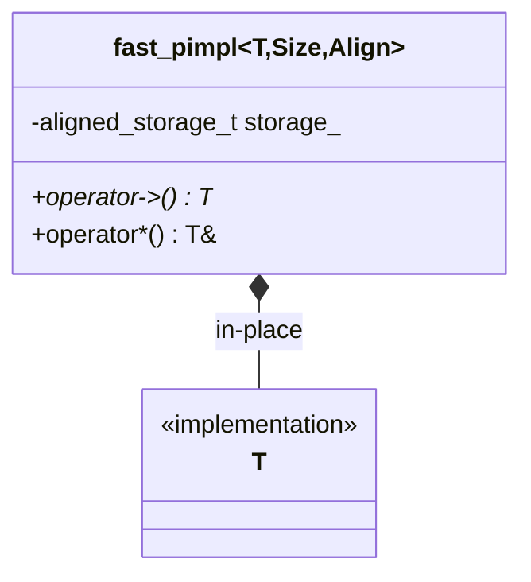
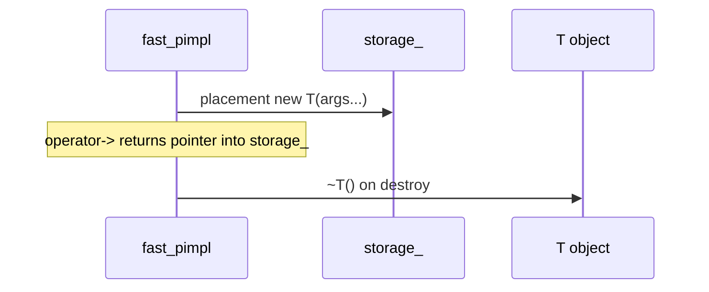

## fast PIMPL (`xitren::func::fast_pimpl`)

### Что делает
PIMPL без динамических аллокаций: объект `T` размещается **in-place** в `std::aligned_storage_t<Size, Alignment>` внутри обёртки.

### Когда применяется
- Хотим скрыть реализацию (PIMPL), но избежать `new/delete` и фрагментации.
- Нужна предсказуемость размера и расположения (embedded/low-latency).

### Пример применения

```cpp
struct Impl { int x; void inc(){ ++x; } };

using P = xitren::func::fast_pimpl<Impl, /*Size*/64, /*Alignment*/alignof(Impl)>;
P p{Impl{1}};
p->inc();
```



### Что происходит внутри (подробно)
- В конструкторе: `new (get()) T(args...)` — placement new в заранее выделенном буфере.
- В деструкторе: `get()->~T()`.
- Есть compile-time валидация `Size/Alignment` относительно `sizeof(T)/alignof(T)` (через `static_assert`).



### Как контролировать успешность операций
- **Компиляция**: если `Size`/`Alignment` заданы неверно — ошибка компиляции.
- **Рантайм**: обычные инварианты вашего `T`, т.к. PIMPL лишь управляет размещением.

