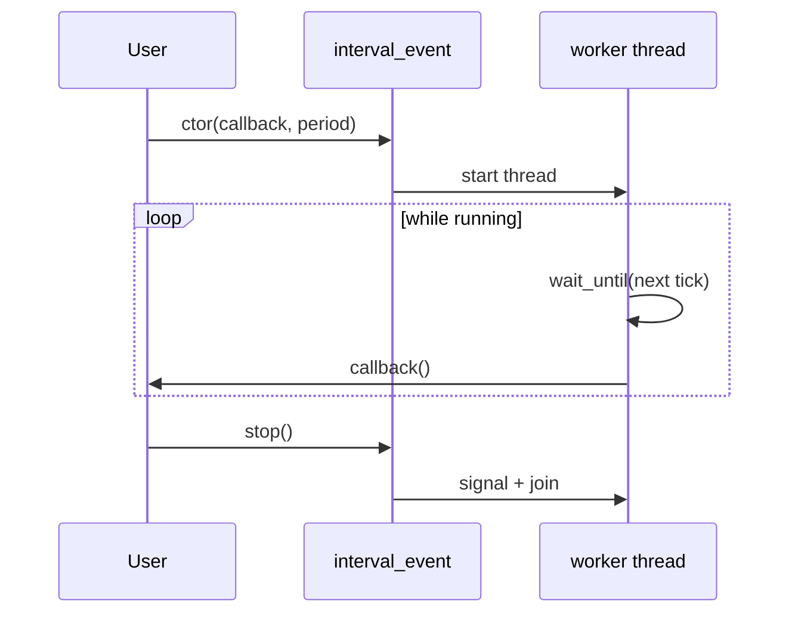
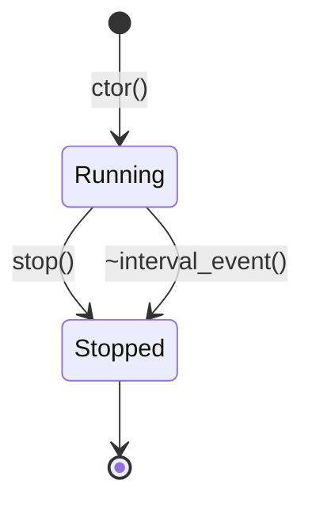

## Interval event (`xitren::func::interval_event`)

### Что делает
Запускает отдельный поток, который **периодически вызывает callback** с заданным интервалом.

### Когда применяется
- Нужен простой таймер “каждые N мс” без внешних зависимостей.
- Тестовые/утилитарные задачи на host.

### Пример применения

```cpp
using namespace std::chrono_literals;
std::atomic<int> cnt{};

xitren::func::interval_event ev([&]{ ++cnt; }, 100ms, 1ms);
std::this_thread::sleep_for(1s);
ev.stop();
```



### Что происходит внутри (подробно)
- В конструкторе создаётся `std::thread`, который:
  - ждёт следующего “тика” по `steady_clock`,
  - вызывает callback,
  - учитывает изменение периода “на лету” (значения лежат в атомиках).
- `stop()`:
  - ставит `running_=false`,
  - будит `condition_variable`,
  - делает `join()` для потока.



### Как контролировать успешность операций
- **Жив ли таймер**: счётчик/метка в callback увеличивается.
- **Остановка**: после `stop()` счётчик перестаёт расти.
- **Тайминг**: на не realtime OS возможен джиттер, поэтому проверять “в диапазоне”.

