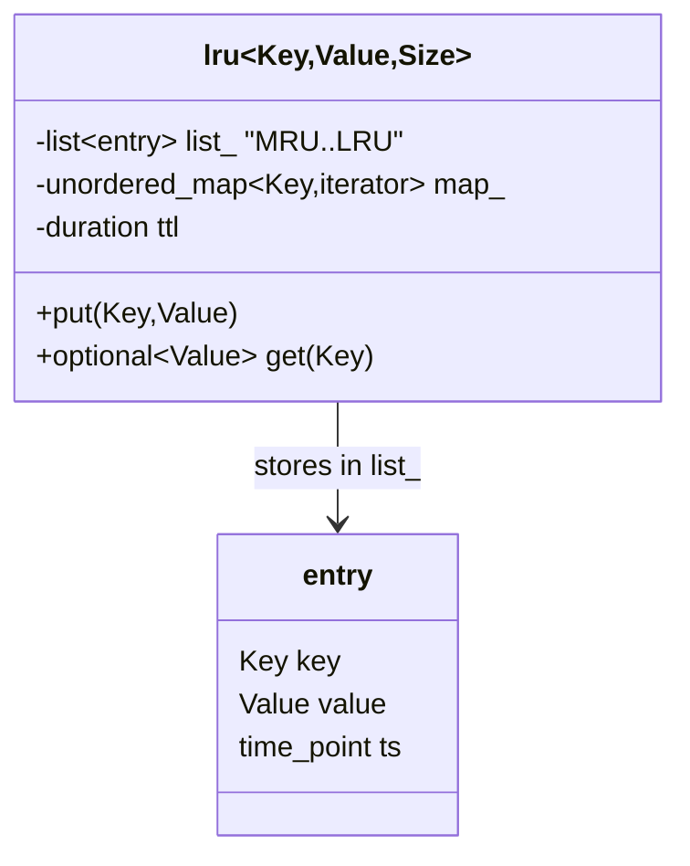

## LRU cache (`xitren::cache::lru`)

### Что делает
Кэш фиксированной ёмкости `Size` с политикой вытеснения **Least Recently Used** и опциональным TTL (истечение по времени).

### Когда применяется
- Нужно ограничить память и держать “самые свежие” значения.
- Нужен TTL: автоматически выкидывать протухшие записи.
- Вариант `Exception=false` удобен там, где исключения запрещены/нежелательны.

### Пример применения

```cpp
using namespace std::chrono_literals;
xitren::cache::lru<int, std::string, 8, false> c{1s}; // TTL = 1s

c.put(10, "ten");
auto v = c.get(10); // std::optional<std::string>
if (v) { /* use *v */ }
```



### Что происходит внутри (подробно)
- Хранилище состоит из:
  - `std::list<entry> list_`: порядок — от MRU (front) к LRU (back).
  - `std::unordered_map<Key, list::iterator> map_`: быстрый доступ к элементу списка.
- `put(key, value)`:
  - если ключ существует: обновляет `value` + timestamp и перемещает узел в `front` (MRU).
  - если новый ключ и кэш заполнен: удаляет `back` (LRU) и убирает ключ из `map_`.
  - вставляет новый узел в `front` и сохраняет итератор в `map_`.
- `get(key)`:
  - если ключа нет: `std::nullopt` или `throw cache_missed`.
  - если TTL задан и запись протухла: удаляет запись и возвращает `std::nullopt` или `throw cache_timeout`.
  - иначе: перемещает узел в `front` и возвращает `Value` (по значению в `std::optional`).
- Время берётся из `steady_clock` (устойчиво к изменению системного времени).

```mermaid
sequenceDiagram
    participant U as User
    participant C as lru
    U->>C: put(k,v)
    alt key exists
        C->>C: update value+ts; move node to front
    else new key
        alt cache full
            C->>C: evict back (LRU)\nremove from map_
        end
        C->>C: push_front; map_[k]=iterator(front)
    end
    U->>C: get(k)
    alt missing
        C-->>U: nullopt / cache_missed
    else expired
        C->>C: erase list+map
        C-->>U: nullopt / cache_timeout
    else hit
        C->>C: move node to front
        C-->>U: optional(value)
    end
```

### Как контролировать успешность операций
- **`put`**:
  - не возвращает значение; успех можно проверять последующим `get()`.
- **`get`**:
  - при `Exception=false`: `std::optional` ⇒ `has_value()`/`!has_value()`.
  - при `Exception=true`: перехват `cache_missed` / `cache_timeout`.
- **Поведение вытеснения**:
  - после `put` сверх ёмкости старый LRU должен перестать находиться.
- **TTL**:
  - после задержки > TTL `get()` должен вернуть пусто/кинуть `cache_timeout`.

