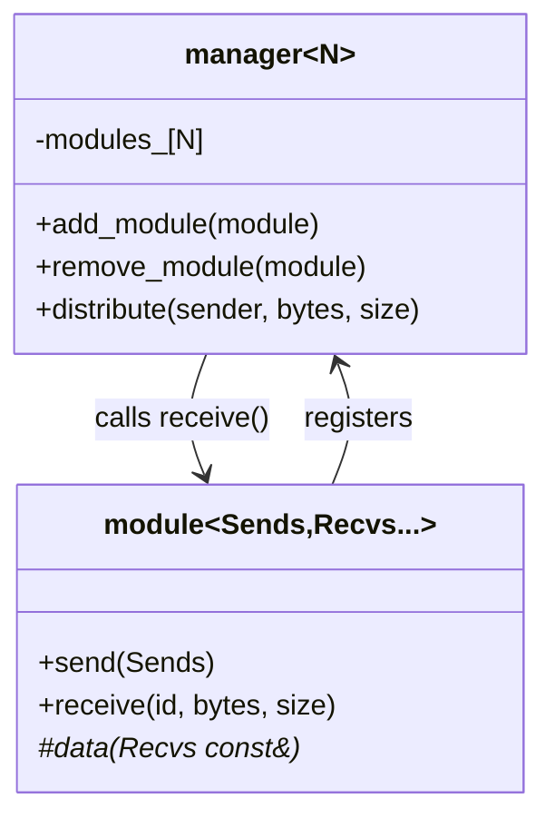
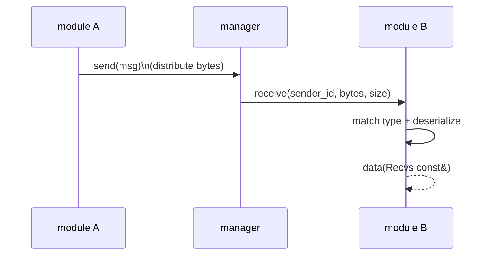

## Mediator (`xitren::comm::manager` / `xitren::comm::module`)

### Что делает
Mediator уменьшает связность модулей: модули **не знают друг о друге**, они посылают сообщения менеджеру, а менеджер распределяет сообщения подписанным модулям.

### Когда применяется
- Есть набор компонент/модулей, которые обмениваются событиями/пакетами.
- Хотим избежать “сетки зависимостей” и централизовать маршрутизацию.

### Пример применения

```cpp
using namespace xitren::comm;

struct data1 { int i1; };
struct data2 { int i1; int i2; };

class m1 : module<data1, data2> {
public:
  using module::module;
  void data(data2 const&) override { /* receive */ }
  void test() { send(data1{}); }
};

manager<8> bus;
m1 mod(bus);
mod.test();
```



### Что происходит внутри (подробно)
- `manager<Sources>` хранит массив `base::module*` и умеет:
  - `add_module/remove_module`
  - `distribute(sender, ptr, sz)` — доставить сообщение всем, кроме отправителя
- `module<Sends, Recvs...>`:
  - при создании регистрируется в `manager`,
  - `send(Sends)` сериализует `Sends` в байты и вызывает `manager::distribute`.
  - `receive(id, ptr, sz)` пытается сопоставить `id` (тип отправителя) с одним из `Recvs...` и десериализовать.



### Как контролировать успешность операций
- **Доставка**:
  - в тестах: счётчики/логи в `data(...)` обработчиках получателя.
- **Корректность сериализации**:
  - сообщение должно быть *byte-serializable*.
  - сейчас для безопасности введено ограничение: типы сообщений **должны быть `std::is_trivially_copyable_v<T>`**.
- **Ошибки типов/размера**:
  - если размер не совпадает, конвертация в `module` возвращает `false` и сообщение не доставляется в обработчик.

