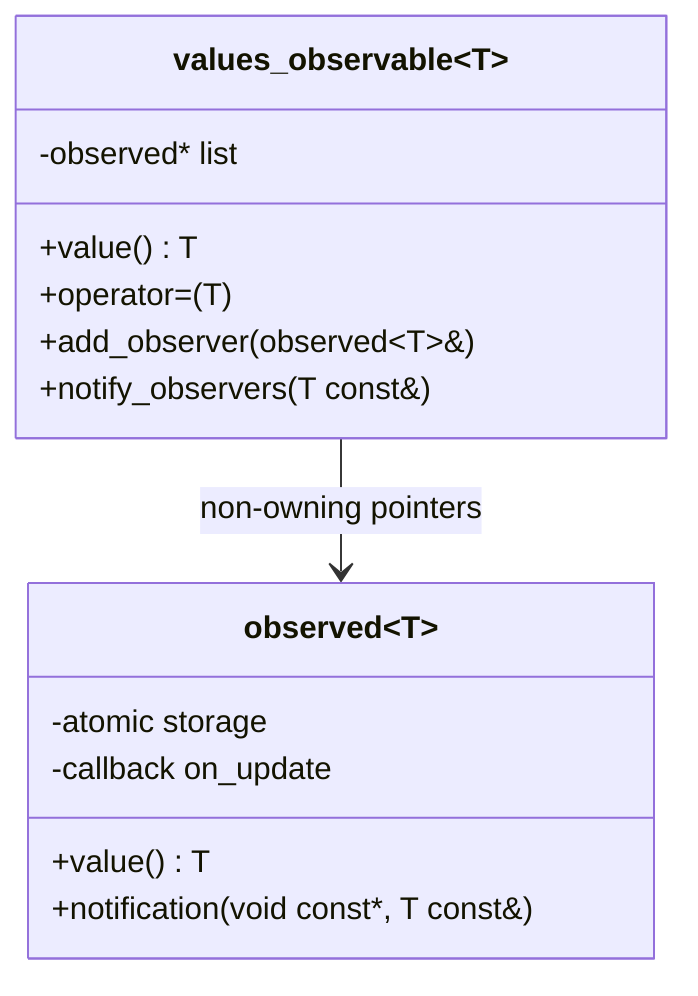

## Observer “values” (`xitren::comm::values`)

### Что делает
Упрощённый Observer для “значений”:
- `values::observable<T, Max>` хранит атомарное значение и уведомляет `values::observed<T>` при изменении.
- `values::observed<T>` хранит своё атомарное значение и опционально вызывает callback `on_update`.

### Когда применяется
- Нужна модель “источник значения → зеркала/подписчики”.
- Нужно безопасно читать/писать значение из разных мест (атомик) и уведомлять подписчиков.

### Пример применения

```cpp
using namespace xitren::comm::values;

observable<int, 2> src{};
observed<int> a{};
observed<int> b{[](int v){ /* реакция на изменение */ }};

src.add_observer(a);
src.add_observer(b);

src = 123;
// a.value() == 123, b.value() == 123
```



### Что происходит внутри (подробно)
- `observable<T, Max>` наследуется от `std::atomic<T>` и на операциях `operator=`, `++`, `+=`, …:
  - обновляет атомик,
  - вызывает `notify_observers(new_value)`.
- `notify_observers` проходит по массиву/вектору указателей на `observed<T>` и вызывает `observed::notification(src, value)`.
- `observed<T>::notification` сохраняет значение в свой `std::atomic<T>` и вызывает callback (если задан).

```mermaid
sequenceDiagram
    participant S as observable<T>
    participant A as observed A
    participant B as observed B
    S->>S: operator=(123)\nstore atomic
    S->>A: notification(src, 123)
    A->>A: store atomic; maybe callback
    S->>B: notification(src, 123)
    B->>B: store atomic; maybe callback
```

### Как контролировать успешность операций
- **add/remove**: возвращают `observer_errors` (для обоих вариантов observable в `values`).
- **доставка значения**:
  - сравнивать `observable.value()` и `observed.value()`,
  - для callback — проверять side-effects (счётчики/флаги).

### Важная деталь про жизненный цикл
Как и в обычном Observer, список наблюдателей — **не владеющие указатели**.
Чтобы избежать use-after-free при разрушении объектов, реализация `values::observable` в деструкторе **не вызывает** методы наблюдателей — только очищает внутренний список.

