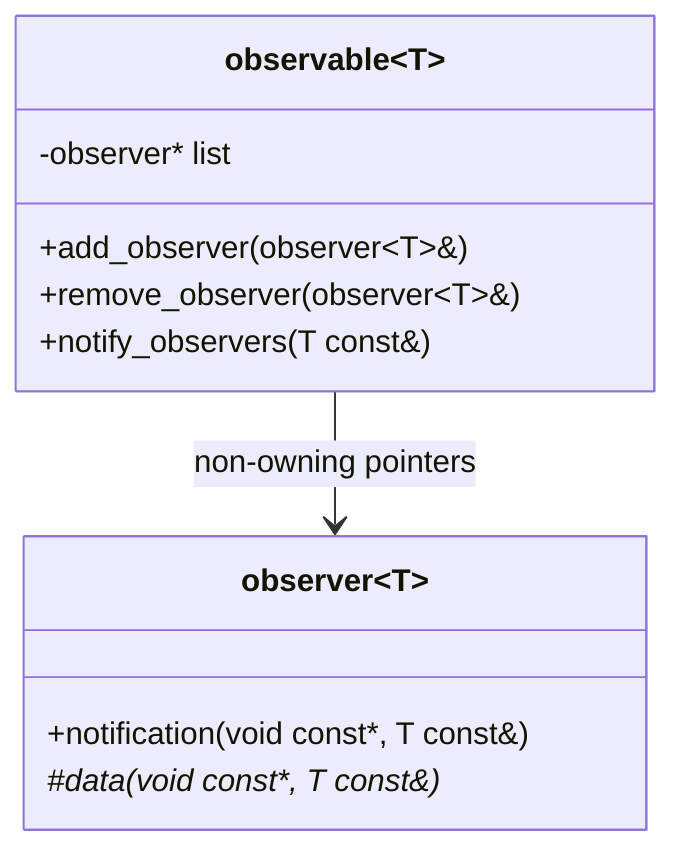
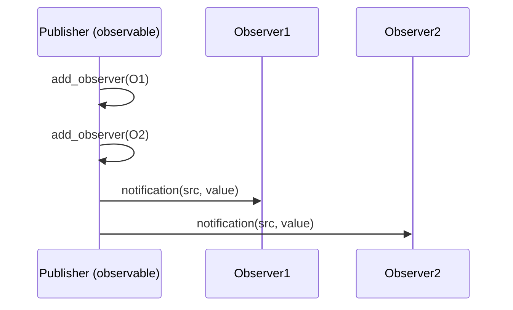

## Observer (`xitren::comm::observable` / `xitren::comm::observer`)

### Что делает
Классический **Observer**: объект `observable<T>` держит список наблюдателей `observer<T>` и рассылает им уведомления с данными типа `T`.

### Когда применяется
- Нужна подписка/уведомления без жёсткой связности “издатель ↔ подписчик”.
- Событийная модель: один источник — много получателей.

### Пример применения

```cpp
struct MyObs : xitren::comm::observer<std::uint8_t> {
  void data(void const*, std::uint8_t const&) override { /* ... */ }
};

MyObs o1, o2;
xitren::comm::observable<std::uint8_t, true, 8> src; // static list (max 8)
src.add_observer(o1);
src.add_observer(o2);
src.notify_observers(42);
```



### Варианты
- **Static**: `observable<T, true, Max>` хранит `std::array<observer<T>*, Max>`.
  - Плюсы: без аллокаций.
  - Минусы: фиксированный лимит подписчиков.
- **Dynamic**: `observable<T, false, 0>` хранит `std::vector<observer<T>*>`.
  - Плюсы: гибко по размеру.
  - Минусы: может аллоцировать.

### Что происходит внутри (подробно)
- `add_observer`:
  - проверяет `contains`, добавляет указатель на `observer`.
  - static-версия возвращает `observer_errors`.
  - dynamic-версия кидает исключение при дубле/ошибке (сейчас так реализовано).
- `notify_observers`:
  - вызывает `observer::notification(src, value)` для каждого подписчика.
  - static-версия имеет защиту от рекурсивного notify (флаг `inside`).
- `remove_observer`:
  - удаляет указатель из списка.



### Как контролировать успешность операций
- **add/remove**:
  - static: проверять возвращаемый `observer_errors`.
  - dynamic: ловить исключение `observable<T,false>::exception`.
- **notify**:
  - в тестах/коде проверять побочные эффекты наблюдателей (счётчики, флаги, полученные значения).

### Важная деталь про жизненный цикл
Список наблюдателей хранит **не владеющие указатели**.
Чтобы избежать use-after-free при разрушении объектов, реализация **не вызывает** методы наблюдателей из деструктора `observable` — очищается только внутренний список.

