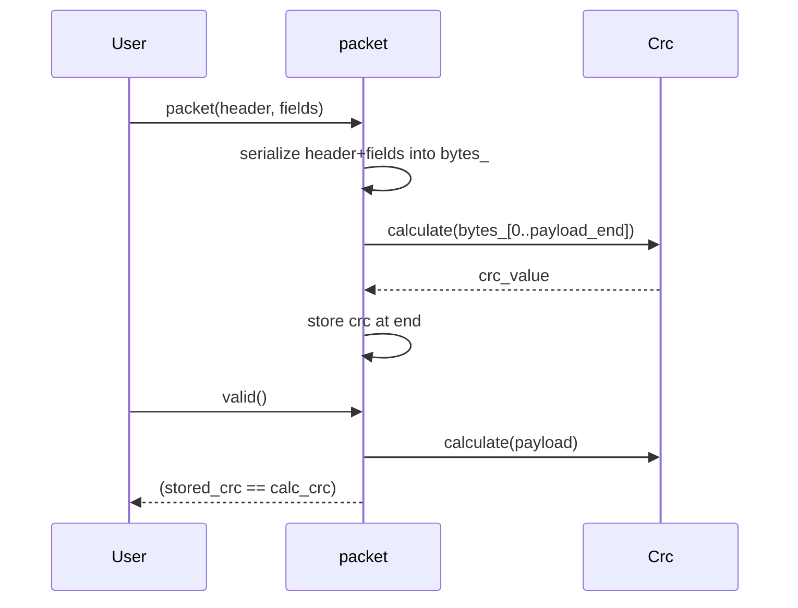

## Packet serializer/deserializer (`xitren::func::packet` / `packet_accessor`)

### Что делает
Инструменты для работы с “пакетами” фиксированной структуры:
- `packet<Header, Fields, Crc>`: хранит байтовый буфер и умеет:
  - собрать пакет из `header + fields` и посчитать CRC,
  - проверить `valid()`,
  - сериализовать/десериализовать в `std::array<uint8_t, N>`.
- `packet_accessor<Max>`: помощник для переменной полезной нагрузки (header/fields + variable data + crc).

### Когда применяется
- Протоколы, где есть фиксированные заголовок/поля и CRC.
- Нужна безопасная сериализация без UB от packed-структур/union type-punning.

### Пример применения

```cpp
struct header_ext { uint8_t magic[2]; };
struct frame { uint16_t data; };

struct crc16ansi {
  using value_type = xitren::func::lsb_t<std::uint16_t>;
  template <typename It>
  static constexpr value_type calculate(It b, It e) noexcept { /* ... */ }
};

auto p = xitren::func::packet<header_ext, frame, crc16ansi>(header_ext{{'N','O'}}, frame{123});
auto bytes = p.to_array();

auto p2 = xitren::func::packet<header_ext, frame, crc16ansi>(bytes);
if (p2.valid()) {
  auto h = p2.header();   // by value
  auto f = p2.fields();   // by value
}
```

```mermaid
flowchart LR
    H[Header bytes] --> P[packet bytes_]
    F[Fields bytes] --> P
    P --> CRC[crc bytes]
    subgraph Layout[length = sizeof(Header)+sizeof(Fields)+sizeof(crc)]
      P
    end
```

### Что происходит внутри (подробно)
- `packet` хранит `std::array<uint8_t, length> bytes_` как “источник истины”.
- `serialize(header, fields)`:
  - пишет `Header`, затем `Fields` в `bytes_` через `func::data<T>::serialize`,
  - вычисляет CRC по байтам `header+fields`,
  - записывает CRC в конец.
- `valid()` пересчитывает CRC и сравнивает с записанным.
- Доступоры `header()/fields()/crc()` делают `deserialize` из байтов (по значению).



### Как контролировать успешность операций
- **Корректность пакета**: `valid() == true`.
- **Десериализация**: проверка `header/fields` на ожидаемые значения.
- **Ограничения**:
  - `func::data<T>` требует `T` быть `trivially_copyable` (для безопасной байтовой сериализации).
  - CRC-тип должен предоставлять `value_type` и `calculate(begin, end)`.

