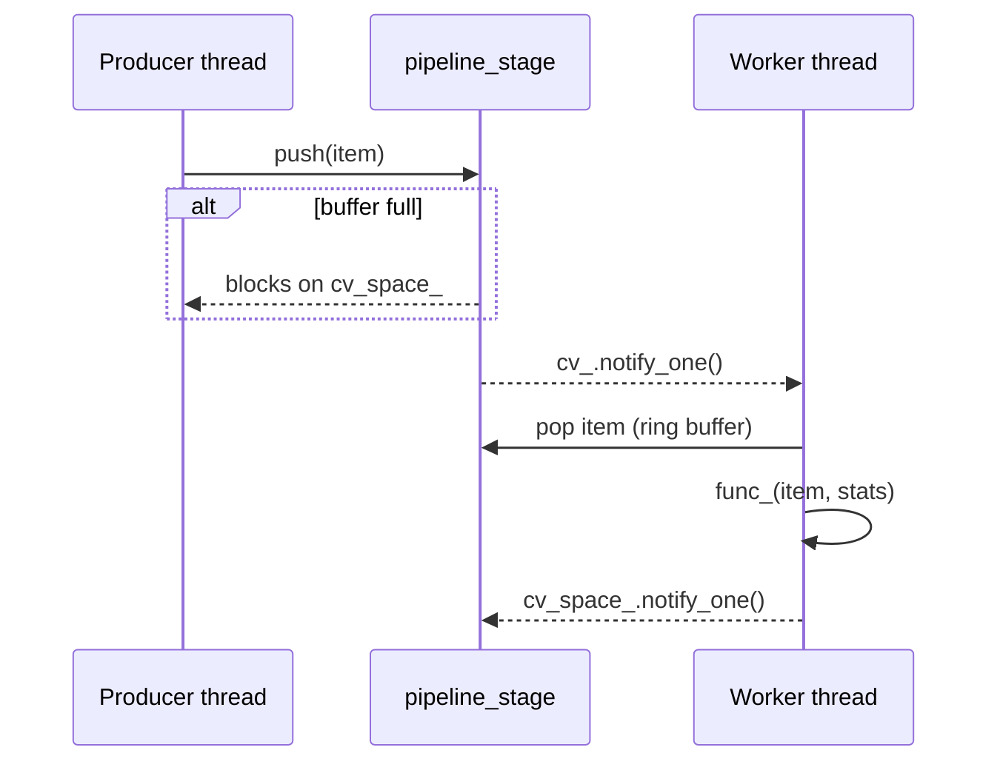

## Pipeline (`xitren::comm::pipeline_stage` / `pipeline_stage_pool`)

### Что делает
Пайплайн-обработчик в отдельном потоке (или пул потоков) с bounded buffer:
- `pipeline_stage<T, NextT, BufferSize, Log>` — один consumer-thread, `push()` кладёт задания.
- `pipeline_stage_pool<T, NextT, BufferSize, PoolSize, Log>` — несколько независимых очередей/потоков, задания распределяются по “наименее загруженному” worker.

### Когда применяется
- Нужна асинхронная обработка событий/строк/пакетов без блокировки основного потока.
- Нужна ограниченная память (bounded buffer) и предсказуемая нагрузка.

### Пример применения

```cpp
using namespace xitren::comm;

struct LogCout {
  static auto& trace(){ return std::cout; }
  static auto& debug(){ return std::cout; }
  static auto& warning(){ return std::cout; }
  static auto& error(){ return std::cerr; }
  static auto& critical(){ return std::cerr; }
};

using stage_t = pipeline_stage<std::string, void, 1024, LogCout>;
stage_t s([](pipeline_stage_exception, std::string const& msg, std::pair<int,int>) {
  LogCout::debug() << msg << "\n";
});
s.push("hello");
```



### Что происходит внутри (подробно)
- `push()`:
  - кладёт элемент в кольцевой буфер `std::array<std::optional<T>, BufferSize>`.
  - **если буфер заполнен — блокируется**, пока consumer не освободит место.
- Worker thread:
  - ждёт `cv_` пока `size_ > 0` или пока не закрыто.
  - вытаскивает элемент, освобождает слот, будит `cv_space_`.
  - вызывает пользовательскую функцию `func_(..., item, stats)`.
  - собирает метрики времени/загрузки (скользящее окно на 10 измерений).
- `pipeline_stage_pool` делает то же самое, но для `PoolSize` независимых очередей/потоков.

```mermaid
flowchart LR
    A[push()] --> B{choose min loaded queue}
    B --> Q1[queue 0]
    B --> Q2[queue 1]
    B --> QN[queue N-1]
    Q1 --> T1[worker 0]
    Q2 --> T2[worker 1]
    QN --> TN[worker N-1]
```

### Как контролировать успешность операций
- **Доставка**:
  - эффект внутри callback (счётчики, лог, записи).
  - в тестах проекта это проверяется количеством обработанных элементов.
- **Контроль backpressure**:
  - если producer быстрее consumer, `push()` будет блокироваться — это и есть механизм контроля успешности без потери данных.
- **Корректное завершение**:
  - при разрушении объекта ставится `closed_`, будятся condition_variable и выполняется `join()`.

