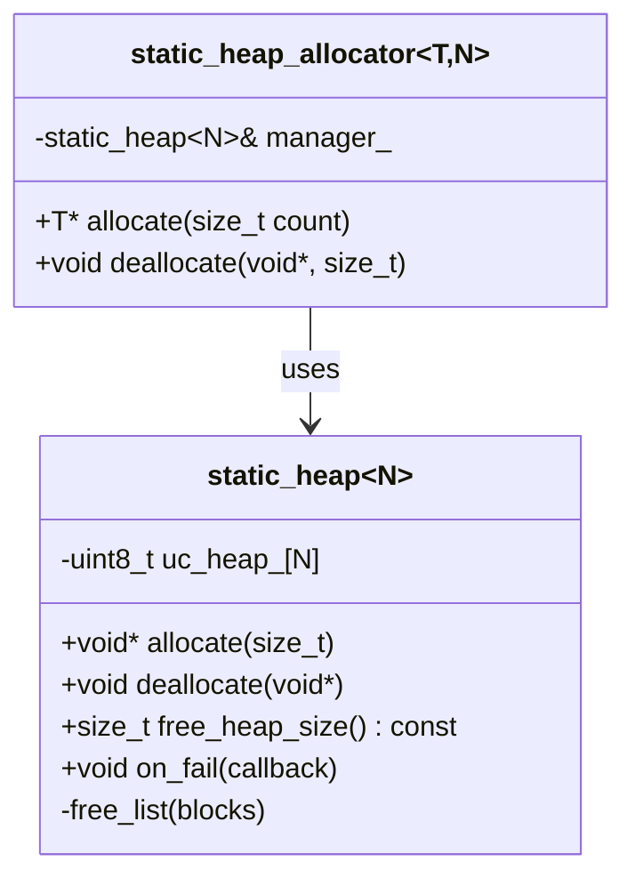

## Static heap + allocator (`xitren::allocators::static_heap` / `static_heap_allocator`)

### Что делает
- `static_heap<N>`: простая “куча” фиксированного размера **внутри массива** (без `malloc`).
- `static_heap_allocator<T, N>`: STL-аллокатор, который выделяет память из `static_heap<N>` и позволяет использовать стандартные контейнеры без динамической кучи ОС.

### Когда применяется
- Embedded/RT: когда нельзя/не хочется использовать глобальную динамическую кучу.
- Тестирование поведения контейнеров при ограниченной памяти.
- Контроль фрагментации / лимитов.

### Пример применения

```cpp
constexpr std::size_t Pool = 256;
xitren::allocators::static_heap<Pool> heap{};
xitren::allocators::static_heap_allocator<int, Pool> alloc{heap};

std::vector<int, decltype(alloc)> v{alloc};
v.reserve(8);
v.push_back(1);
```

```mermaid
flowchart TD
    A[allocate(bytes)] --> B[align bytes + header]
    B --> C{find free block\n>= wanted}
    C -- no --> F[return nullptr\n(or throw bad_alloc via allocator)]
    C -- yes --> D{block larger\nthan needed?}
    D -- yes --> E[split block:\nallocated + remainder]
    D -- no --> G[use block as-is]
    E --> H[mark allocated\nreturn ptr after header]
    G --> H
```

### Что происходит внутри (подробно)
- `static_heap<N>` хранит `uint8_t uc_heap_[N]` и ведёт список свободных блоков (free list).
- `allocate(bytes)`:
  - выравнивает размер под `port_byte_alignment`.
  - ищет первый подходящий блок в free list (по адресу).
  - при необходимости **делит блок** на “выделенный” и “остаток”.
  - помечает блок как занятый (бит в старшем разряде размера) и возвращает указатель **после** заголовка блока.
- `deallocate(ptr)`:
  - смещается назад на размер заголовка.
  - помечает блок свободным и вставляет в free list.
  - пытается **склеить** соседние блоки (уменьшает фрагментацию).
- `static_heap_allocator<T, N>`:
  - `allocate(count)` просит `count*sizeof(T)` байт у `static_heap`.
  - при `nullptr` кидает `std::bad_alloc` (как обычные аллокаторы).
  - `operator==` сравнивает общий `heap` (аллокаторы равны, если работают с одним менеджером).



### Как контролировать успешность операций
- **Успех allocate**:
  - `static_heap::allocate` возвращает не-`nullptr`.
  - `static_heap_allocator::allocate` не кидает `std::bad_alloc`.
- **Успех deallocate**:
  - отсутствие UB: deallocate должен получать указатель, выданный этим heap.
  - можно контролировать через `free_heap_size()`/`minimum_ever_free_heap_size()`.
- **Инварианты/проверки**:
  - после серии операций `free_heap_size()` ожидаемо меняется (в тестах проекта это уже проверяется).
  - при необходимости добавить asserts/логирование по `on_fail()`.

