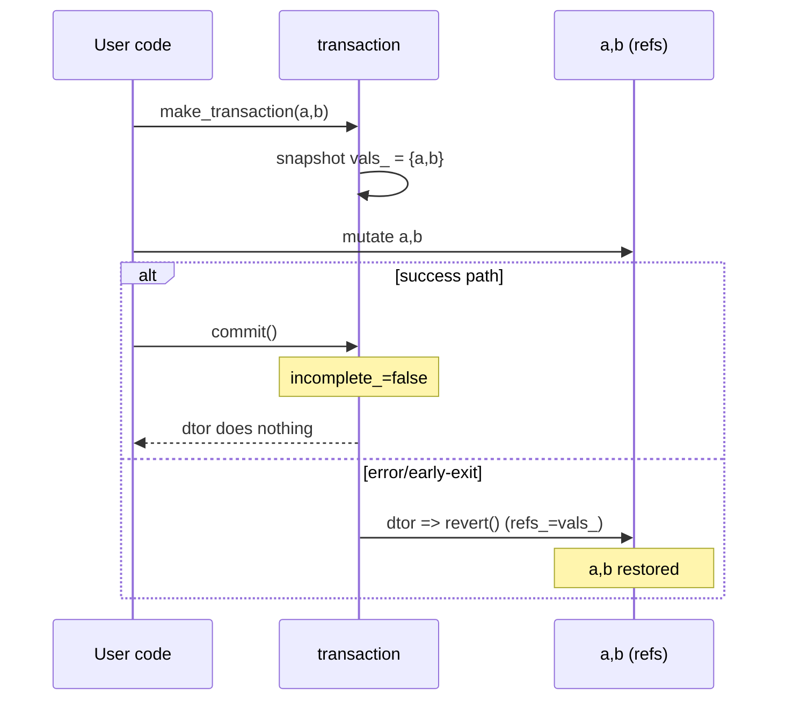

## Transaction (`xitren::func::transaction`)

### Что делает
RAII-объект, который **снимает “снимок”** нескольких переменных при создании и, если `commit()` не был вызван, **откатывает** значения в деструкторе.

### Когда применяется
- **Нужно атомарно** обновить несколько полей/переменных и в случае ошибки вернуть всё как было.
- Удобно в коде, где есть исключения/ранние `return` и хочется гарантированного rollback.

### Пример применения

```cpp
int a = 1;
int b = 2;
auto tr = xitren::func::make_transaction(a, b);

a = 10;
b = 20;

// если всё ок
tr.commit();
// иначе (исключение/return) — a,b откатятся
```



### Что происходит внутри (подробно)
- В конструкторе сохраняются:
  - `refs_`: `std::tuple<Args&...>` — ссылки на оригинальные переменные.
  - `vals_`: `std::tuple<Args...>` — копии исходных значений.
- Пока `incomplete_ == true`, деструктор вызывает `revert()`, который делает `refs_ = vals_` (присваивание кортежей).
- `commit()` просто ставит флаг `incomplete_ = false`.

### Как контролировать успешность операций
- **Критерий успеха**: вызван `commit()`.
- **Проверка на практике**:
  - в тестах/коде: после участка “транзакции” проверить, что значения либо изменились (commit), либо откатились (не commit).
- **Важные ограничения**:
  - типы `Args...` должны быть копируемыми и присваиваемыми (иначе `vals_`/откат не сработают).
  - откат выполняется в деструкторе: если присваивание при откате может бросать исключения — это риск (деструкторы лучше держать `noexcept`-логикой).

